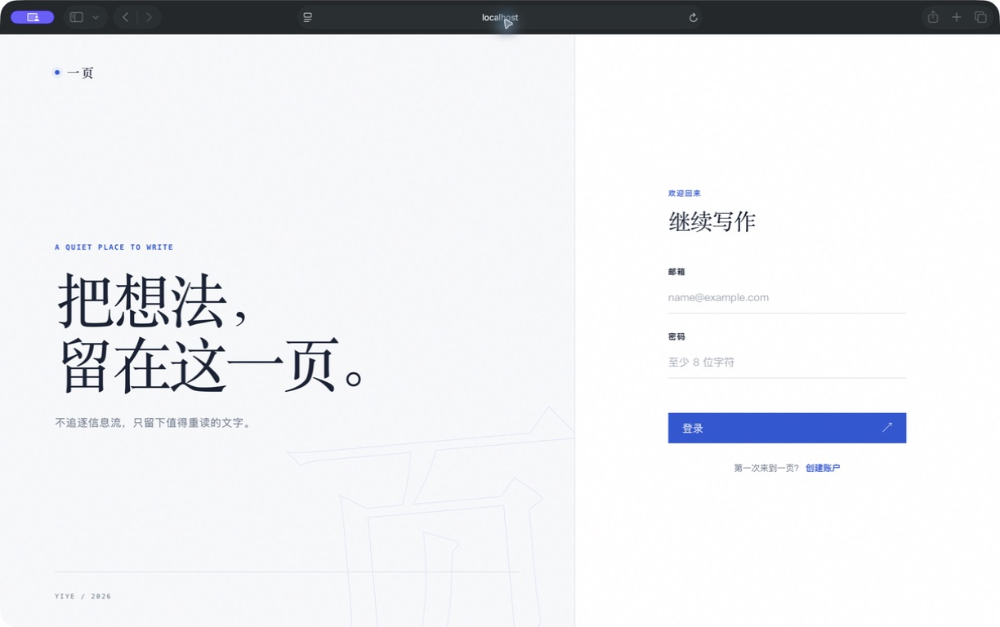
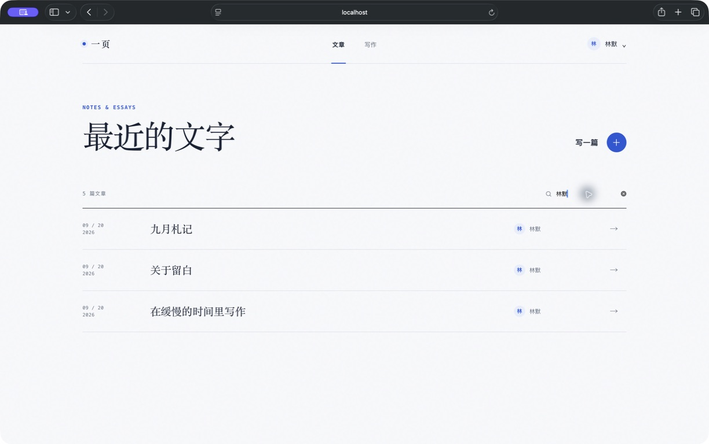
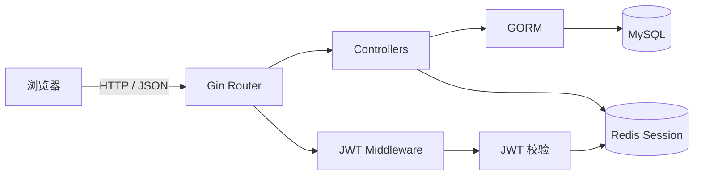
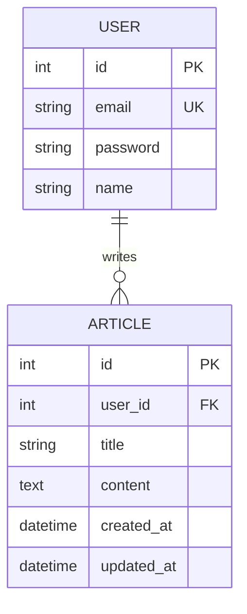

# 一页 · YIYE

<div align="center">

一个安静、专注的轻量写作平台。  
使用 **Go + Gin + MySQL + Redis** 构建，提供完整的用户认证、JWT 双令牌会话管理与文章 CRUD 能力。


</div>



## 项目简介

「一页」是一个前后端一体的内容发布 Web 应用。用户可以注册、登录、浏览和搜索文章，并管理自己发布的内容。项目没有依赖前端框架，以原生 HTML、CSS 和 JavaScript 完成交互界面，后端则通过 Gin 提供 RESTful API。



## 核心功能

- **完整认证流程**：邮箱注册、bcrypt 密码哈希、登录与主动退出。
- **JWT 双令牌机制**：Access Token 有效期 15 分钟，Refresh Token 有效期 7 天。
- **有状态会话控制**：Redis 保存会话与 JTI，支持令牌轮换、刷新令牌单次使用和会话撤销。
- **文章管理**：创建、列表、详情、编辑与删除；仅作者本人可以修改或删除文章。
- **数据持久化**：使用 GORM 操作 MySQL，并在服务启动时自动迁移数据表。
- **响应式 Web UI**：支持文章搜索、阅读弹窗、字数统计、错误提示和移动端布局。
- **基础安全防护**：参数校验、统一鉴权中间件、JWT 算法白名单及前端输出转义。

## 技术栈

| 分层 | 技术 |
| --- | --- |
| Web 框架 | Go、Gin |
| ORM / 数据库 | GORM、MySQL |
| 会话存储 | Redis |
| 身份认证 | JWT（HS256）、bcrypt |
| 前端 | HTML5、CSS3、原生 JavaScript |
| 配置管理 | godotenv |

## 系统架构



登录成功后，服务端生成独立的 Access Token 和 Refresh Token，并将当前 JTI 写入 Redis。刷新令牌时通过 Redis `WATCH` 事务校验并替换会话状态，旧 Refresh Token 因此无法再次使用；退出登录会直接删除对应会话。

## 项目结构

```text
.
├── auth/               # JWT 生成、解析、鉴权中间件与 Redis 会话
├── controllers/        # 用户、认证和文章接口
├── db/                 # MySQL 与 Redis 初始化
├── models/             # GORM 数据模型
├── web/
│   ├── assets/         # 前端样式与交互脚本
│   └── index.html      # 单页应用入口
├── .env.example        # 环境变量模板
├── main.go             # 路由注册与服务启动
└── go.mod
```

## 快速开始

### 1. 环境要求

- Go 1.27+
- MySQL 8+
- Redis 6+

### 2. 获取项目

```bash
git clone https://github.com/Jackreceive/ContentHub.git
cd ContentHub
go mod download
```

### 3. 初始化数据库

```sql
CREATE DATABASE boiler
  CHARACTER SET utf8mb4
  COLLATE utf8mb4_unicode_ci;
```

当前项目默认使用以下本地连接：

```text
root:@tcp(localhost:3306)/boiler
```

如果你的 MySQL 用户名、密码或端口不同，请修改 [`db/mysql.go`](db/mysql.go) 中的 DSN。

### 4. 配置环境变量

```bash
cp .env.example .env
```

编辑 `.env`：

```dotenv
# 两个密钥必须不同，且均不少于 32 个字符
JWT_ACCESS_SECRET=replace-with-a-random-access-secret
JWT_REFRESH_SECRET=replace-with-a-random-refresh-secret

REDIS_ADDR=localhost:6379
REDIS_PASSWORD=
REDIS_DB=0
```

可以使用 `openssl rand -hex 32` 分别生成两个随机密钥。`.env` 已被 Git 忽略，请勿提交真实密钥。

### 5. 启动服务

确认 MySQL 与 Redis 已启动，然后执行：

```bash
go run .
```

访问 [http://localhost:9090](http://localhost:9090) 即可使用。

## API 概览

除注册、登录和刷新令牌外，其余接口均需携带请求头：

```http
Authorization: Bearer <access_token>
```

| 方法 | 路径 | 说明 | 鉴权 |
| --- | --- | --- | :---: |
| `POST` | `/v1/user/register` | 注册用户 | 否 |
| `POST` | `/v1/user/login` | 登录并获取双令牌 | 否 |
| `POST` | `/v1/token/refresh` | 轮换 Access / Refresh Token | 否 |
| `GET` | `/v1/user/logout` | 撤销当前会话 | 是 |
| `GET` | `/v1/articles` | 获取全部文章 | 是 |
| `POST` | `/v1/article` | 发布文章 | 是 |
| `GET` | `/v1/article/:id` | 获取文章详情 | 是 |
| `PUT` | `/v1/article/:id` | 修改自己的文章 | 是 |
| `DELETE` | `/v1/article/:id` | 删除自己的文章 | 是 |

### 请求示例

注册：

```bash
curl -X POST http://localhost:9090/v1/user/register \
  -H 'Content-Type: application/json' \
  -d '{
    "name": "Jack",
    "email": "jack@example.com",
    "password": "your-password"
  }'
```

登录：

```bash
curl -X POST http://localhost:9090/v1/user/login \
  -H 'Content-Type: application/json' \
  -d '{
    "email": "jack@example.com",
    "password": "your-password"
  }'
```

发布文章：

```bash
curl -X POST http://localhost:9090/v1/article \
  -H 'Content-Type: application/json' \
  -H 'Authorization: Bearer <access_token>' \
  -d '{
    "title": "第一篇文章",
    "content": "从这里开始写……"
  }'
```

## 数据模型



## 测试

MySQL 服务启动且 `boiler` 数据库可访问时，运行：

```bash
go test ./...
```

项目已完成注册、登录、令牌刷新、文章增删改查和退出登录的端到端冒烟验证。

## 后续计划

- [ ] 使用 Docker Compose 一键启动应用、MySQL 与 Redis
- [ ] 将 MySQL DSN 完整迁移至环境变量
- [ ] 增加控制器与认证模块的单元测试
- [ ] 为文章列表增加分页和服务端搜索
- [ ] 增加 OpenAPI / Swagger 文档
